# 🏜️ The Wild Oasis

> A modern, full-featured cabins booking and management system built with React, TypeScript, and Supabase. Manage cabins, bookings, guests, and operations with an intuitive dashboard experience.

<div align="center">

[](https://react.dev)
[](https://www.typescriptlang.org)
[](https://supabase.com)
[](https://tailwindcss.com)
[](https://vite.dev)

[Features](#-features) • [Screenshots](#-screenshots) • [Tech Stack](#-tech-stack) • [Getting Started](#-getting-started) • [Project Structure](#-project-structure) • [API & Backend](#-api--backend)

</div>

---

## ✨ Features

### 📊 Dashboard & Analytics

- **Real-time Statistics**: View total bookings, occupied cabins, and check-in/out activities
- **Advanced Charts**:
  - Booking trends visualization with Recharts
  - Sales performance tracking
  - Duration-based analytics
- **Today's Activity**: Live-updating activity feed showing current day's bookings
- **Skeleton Loaders**: Smooth loading states for better UX during data fetching

### 🛏️ Cabin Management

- **Full CRUD Operations**: Create, read, update, and delete cabin listings
- **Cabin Details**: Manage pricing, capacity, amenities, and descriptions
- **Image Upload**: Add and manage cabin photos directly
- **Filtering & Sorting**: Advanced filtering by capacity, price, and status
- **Pagination**: Efficient handling of large cabin inventories

### 📅 Booking Management

- **Booking Lifecycle**:
  - Create and manage reservations
  - Check-in/check-out operations
- **Filters**:
  - Filter by status (unconfirmed, checked-in, checked-out)
- **Sorting Options**: Sort by date, price, guests, or status
- **Detailed Booking View**: Comprehensive booking details with guest info, pricing, and stay details
- **Delete Functionality**: Remove bookings with confirmation
- **Payment Status Tracking**: Visual indicators for paid/unpaid bookings

### 👥 Guest Viewing

- **Guest Directory**: Browse all registered guests

### 👤 User Account Management

- **Profile Management**: Update personal information and avatar
- **Avatar Upload**: Change profile picture with automatic storage cleanup
- **Password Management**: Secure password change functionality
- **Account Settings**: Manage preferences and account details
- **Authentication**: Secure login and signup with email verification

### 🎨 Theme & UI

- **Dark Mode Support**: Full dark/light mode toggle with system preference detection
- **Responsive Design**: Optimized for desktop, tablet, and mobile devices
- **Accessibility**: WCAG compliant with proper semantic HTML
- **Modern Components**: Shadcn UI components with Tailwind CSS styling
- **Smooth Animations**: Subtle transitions and loading states
- **Toast Notifications**: Real-time feedback with Sonner notifications

### 🔐 Authentication & Security

- **Email Authentication**: Secure login and signup with Supabase Auth
- **Protected Routes**: Role-based access control for dashboard
- **Session Management**: Automatic session handling and refresh
- **Password Hashing**: Industry-standard password security
- **Avatar Storage**: Automatic cleanup of old avatars when updating profile

---

## 📸 Screenshots

### Authentication

**Login Page**
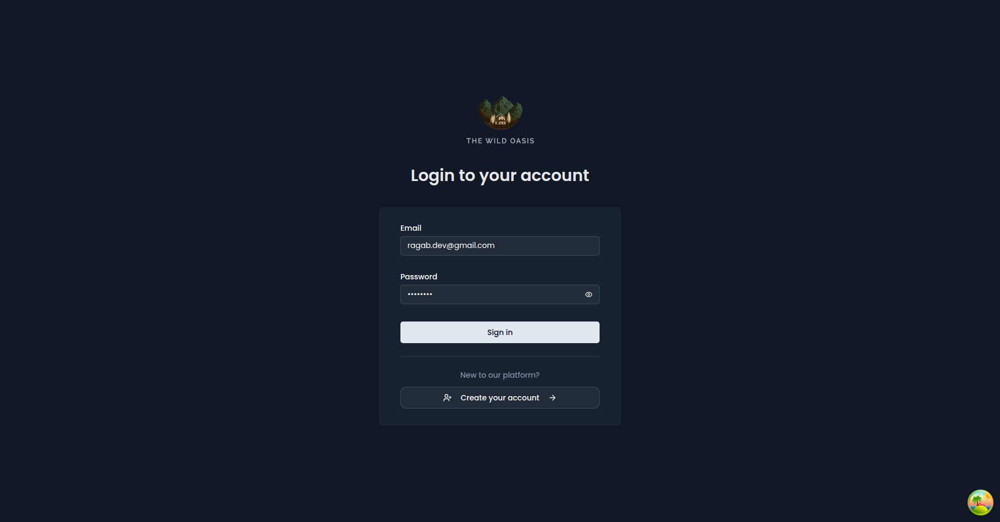

**Sign Up Page**
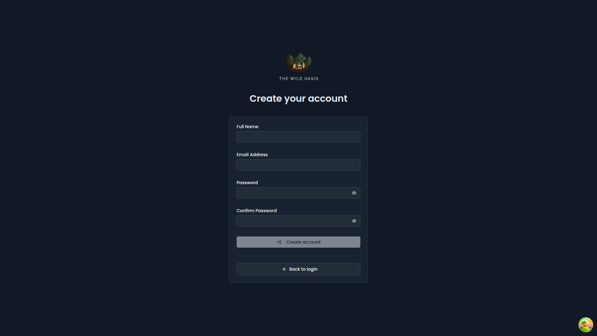

### Dashboard & Analytics

**Main Dashboard - Dark Mode**
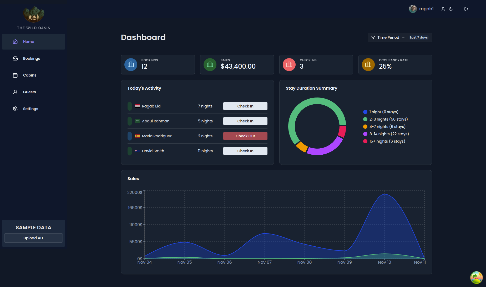

**Dashboard - Light Mode**
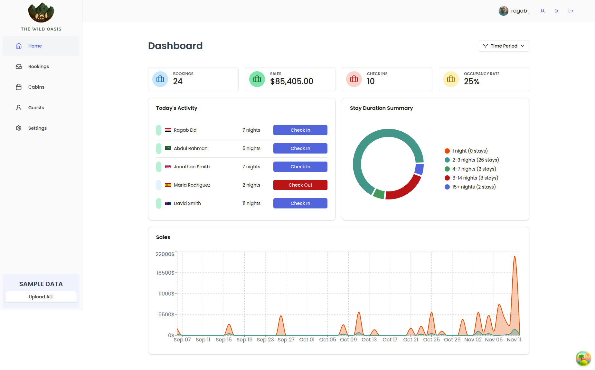

**Dashboard Skeleton Loading State**
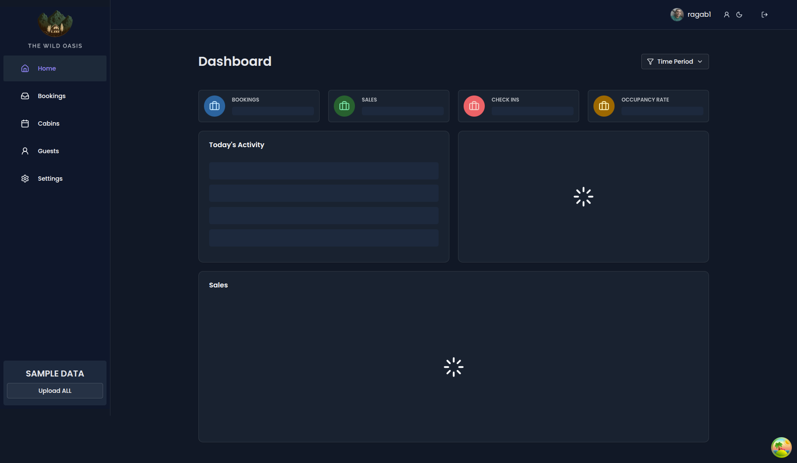

### Booking Management

**Bookings List with Filters & Pagination**


**Booking Details View**
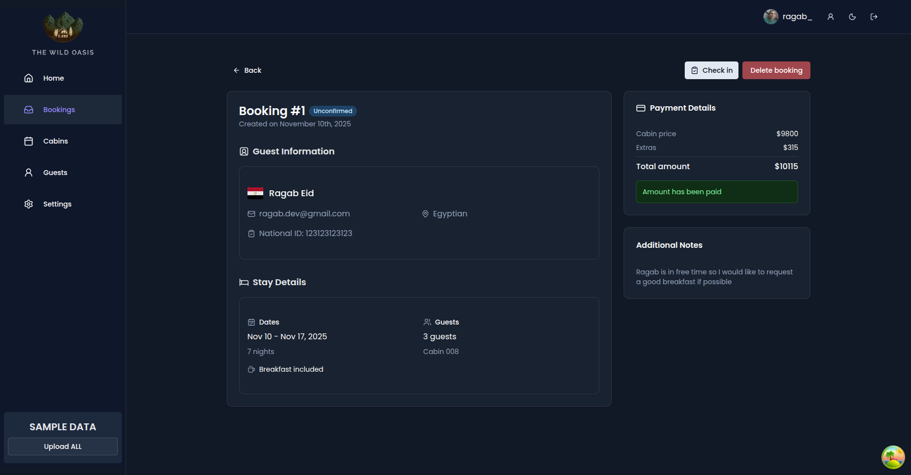

### Cabin Management

**Cabins Directory**
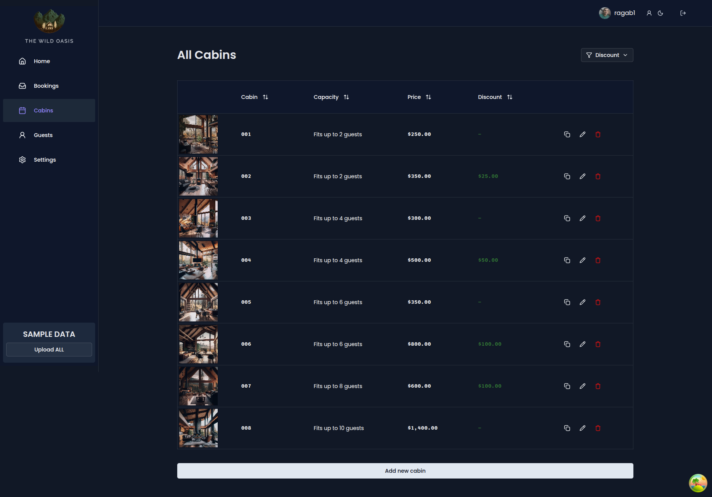

**Cabins editing**
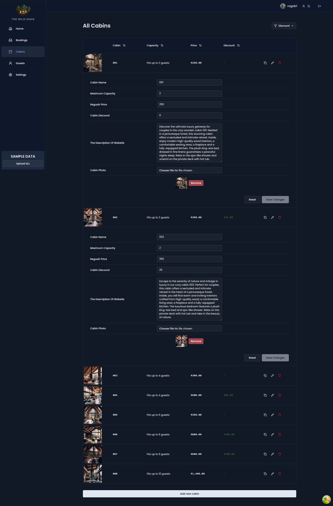

**Cabin Creation**
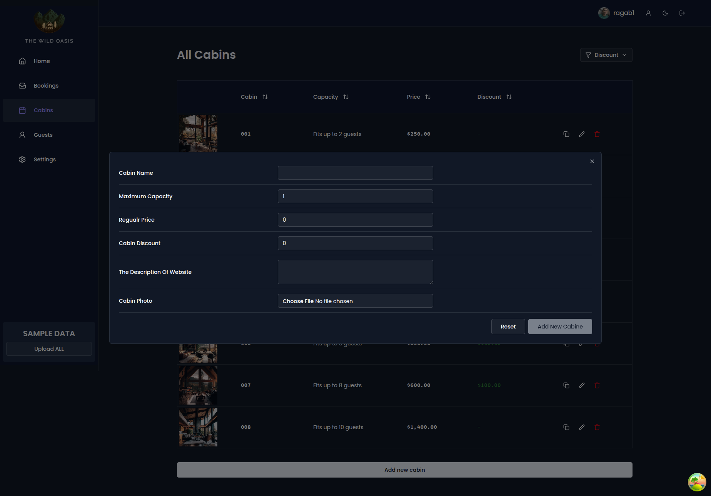

### Guest Management

**Guest Directory**
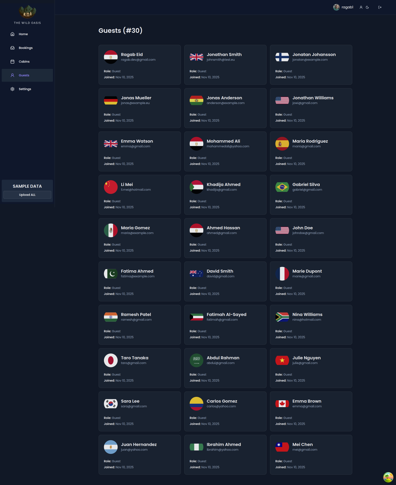

**Guest Loading State**
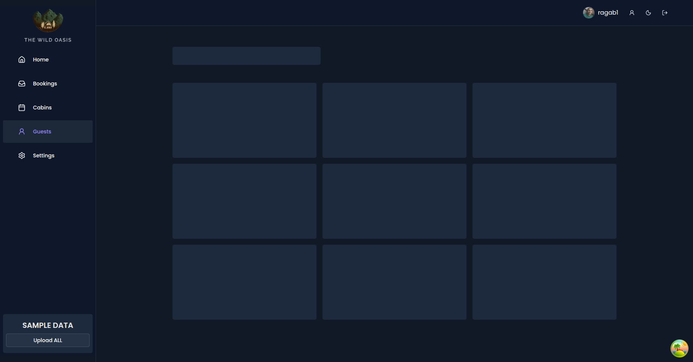

### Account & Settings

**Account Management**


**Account Skeleton Loading**
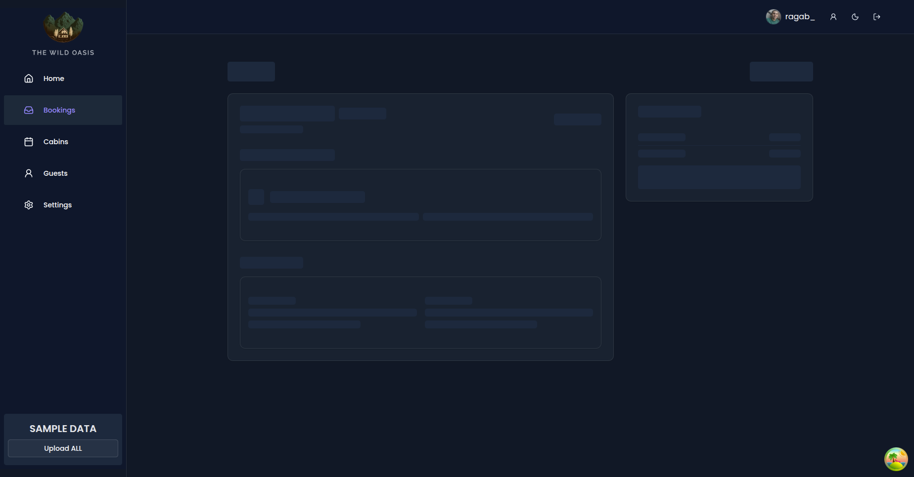

---

## 🛠️ Tech Stack

### Frontend

- **Main**: React 19.1 with TypeScript
- **Build Tool**: Vite 7.1
- **Styling**: Tailwind CSS 4.1 + Tailwind Merge
- **UI Components**: Shadcn UI + Radix UI
- **Form Handling**: React Hook Form + Zod validation
- **State Management**: TanStack React Query
- **Routing**: React Router DOM 7.9
- **Charts**: Recharts 2.15 for data visualization
- **Icons**: Lucide React 0.544
<!-- - **Notifications**: Sonner 2.0 -->
- **Theme**: Next Themes for dark mode support
- **HTTP Client**: Built-in Fetch API with Supabase JS SDK

### Backend & Database

- **Backend as a Service**: Supabase
- **Database**: PostgreSQL (via Supabase)
- **Authentication**: Supabase Auth (Email/Password)
- **File Storage**: Supabase Storage (for avatars and images)

### Development Tools

- **Language**: TypeScript 5.9
- **Linting**: ESLint 9.36
- **Package Manager**: npm
- **Version Control**: Git
- **Code Quality**: Type-safe development with strict TypeScript checking

---

## 🚀 Getting Started

### Prerequisites

- **Node.js**: v16 or higher
- **npm**: v7 or higher
- **Supabase Account**: For backend services
- **Git**: For cloning the repository

### Installation

1. **Clone the repository**

```bash
git clone https://github.com/ragab0/the-wild-oasis.git
cd the-wild-oasis
```

2. **Install dependencies**

```bash
npm install
```

3. **Environment Setup**
   Create a `.env.local` file in the root directory:

```env
VITE_API_URL=https://your-project.supabase.co
VITE_API_PUBLIC_KEY=your-supabase-anon-key
```

Get these values from your Supabase project dashboard:

- Go to [Supabase Dashboard](https://app.supabase.com)
- Select your project
- Navigate to Settings → API
- Copy the Project URL and anon/public API Key

4. **Start development server**

```bash
npm run dev
```

The application will be available at `http://localhost:5173`

5. **Build for production**

```bash
npm run build
```

6. **Preview production build**

```bash
npm run preview
```

### Development Scripts

```bash
npm run dev      # Start development server with HMR
npm run build    # Build for production
npm run preview  # Preview production build locally
npm run lint     # Run ESLint checks
```

---

## 📁 Project Structure

```
the-wild-oasis/
├── src/
│   ├── assets/              # Static assets and mock data
│   │   ├── mockData.ts      # Development mock data
│   │   └── constants.ts     # App-wide constants
│   │
│   ├── components/          # Reusable React components
│   │   ├── ui/              # Shadcn UI components
│   │   │   └── ...
│   │   └── ...
│   │
│   ├── hooks/               # Custom React hooks
│   ├── layouts/             # Page layouts
│   ├── lib/                 # Utility functions and helpers
│   ├── pages/               # Page components
│   │   ├── home/            # Dashboard
│   │   ├── login/           # Authentication pages
│   │   ├── signup/
│   │   ├── bookings/        # Booking management
│   │   ├── cabins/          # Cabin management
│   │   ├── guests/          # Guest management
│   │   ├── users/           # Users directory
│   │   ├── account/         # User account settings
│   │   └── ...
│   ├── providers/           # Context providers
│   ├── services/            # API service layer
│   ├── types/               # TypeScript type definitions
│   ├── utils/               # Utility functions
│   ├── validations/         # Zod validation schemas
│   ├── App.tsx              # Main app component
│   ├── main.tsx             # Entry point
│   └── index.css            # Global styles
│
├── public/                  # Static files
├── vite.config.ts          # Vite configuration
├── tsconfig.json           # TypeScript configuration
├── tailwind.config.ts      # Tailwind CSS config
├── eslint.config.js        # ESLint configuration
├── package.json            # Dependencies & scripts
└── README.md              # This file
```

---

## 🗄️ API & Backend

### Supabase Configuration

The project uses Supabase as the complete backend solution. Here's how everything is structured:

#### Database Schema

**Tables:**

- **auth.users** - Managed by Supabase Auth
- **public.bookings** - Resort booking records
- **public.cabins** - Cabin inventory and details
- **public.guests** - Guest information
- **public.users** - User profiles with extended data

#### Key Features:

- **RLS (Row Level Security)**: Secure data access based on user roles
- **Storage Buckets**:
  - `avatars` - User profile pictures
  - `cabin-images` - Cabin photos (prepared for future use)

#### Authentication Flow

1. User signs up with email/password
2. Supabase Auth creates user record
3. Custom user profile created with avatar storage
4. Session token managed automatically
5. Protected routes verify session on load

#### Data Models

**Booking Model:**

```typescript
{
  id: number;
  cabin_id: number;
  guest_id: number;
  created_at: string;
  start_date: string;
  end_date: string;
  total_nights: number;
  total_guests: number;
  is_paid: boolean;
  has_breakfast: boolean;
  cabin_price: number;
  extra_price: number;
  total_price: number;
  status: "unconfirmed" | "checked-in" | "checked-out";
  observations: string;
  guests: Guest;
  cabins: Cabin;
}
```

**Cabin Model:**

```typescript
{
  id: number;
  name: string;
  max_capacity: number;
  regular_price: number;
  discount: number;
  image: string;
  description: string;
  created_at: string;
}
```

**Guest Model:**

```typescript
{
  id: number;
  email: string;
  full_name: string;
  nationality: string;
  country_flag: string;
  national_id: string;
  created_at: string;
}
```

#### API Endpoints (via PostgREST)

All data operations go through Supabase PostgREST API:

- `GET /rest/v1/bookings` - Fetch bookings with filters
- `POST /rest/v1/bookings` - Create booking
- `PATCH /rest/v1/bookings` - Update booking
- `DELETE /rest/v1/bookings` - Delete booking
- Similar endpoints for cabins, guests, users

#### Accessing Supabase Dashboard

1. Visit [https://app.supabase.com](https://app.supabase.com)
2. Sign in with your account
3. Select "the-wild-oasis" project
4. Navigate to:
   - **Tables Editor**: View/edit database tables
   - **SQL Editor**: Run custom queries
   - **Authentication**: Manage users
   - **Storage**: Manage file uploads
   - **Logs**: View API requests and errors

#### Environment Variables

```env
VITE_API_URL=https://your-project.supabase.co
VITE_API_KEY=your-supabase-public-anon-key
```

These are safe to expose in frontend code (use anon key, not service role key).

---

## 📊 Performance Optimizations

- **React Query Caching**: Smart data caching to reduce API calls
- **Code Splitting**: Route-based code splitting with React Router
- **Image Optimization**: Lazy loading and responsive images
- **Pagination**: Large datasets paginated to reduce memory usage
- **Skeleton Loaders**: Perceived performance improvement

---

## 🤝 Contributing

This is a portfolio project showcasing modern web development practices. While contributions aren't expected, suggestions and improvements are welcome!

---

## 📝 License

This project is part of a portfolio and is available for educational purposes.

---

### Built with ❤️ by [Ragab](https://ragab.vercel.com)
